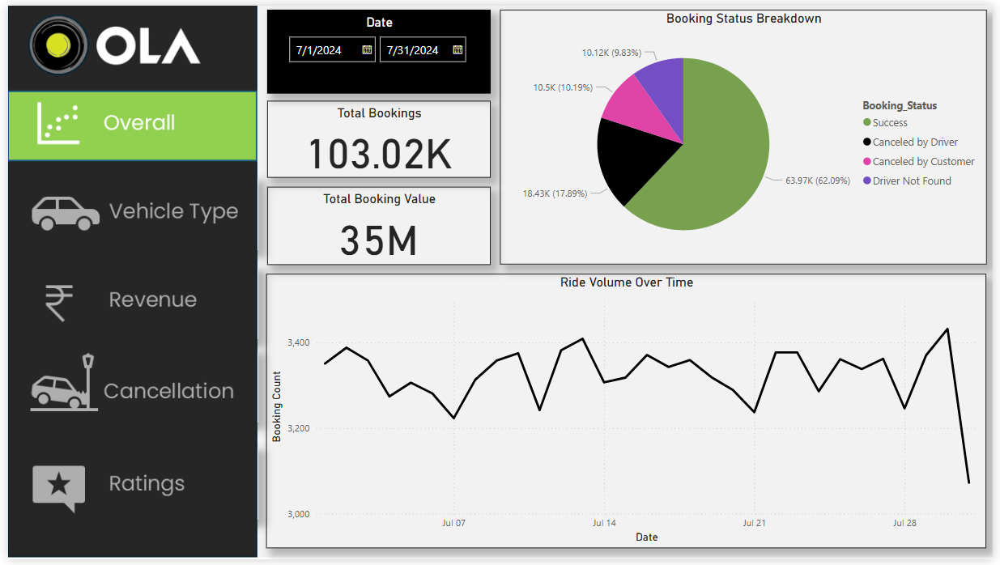
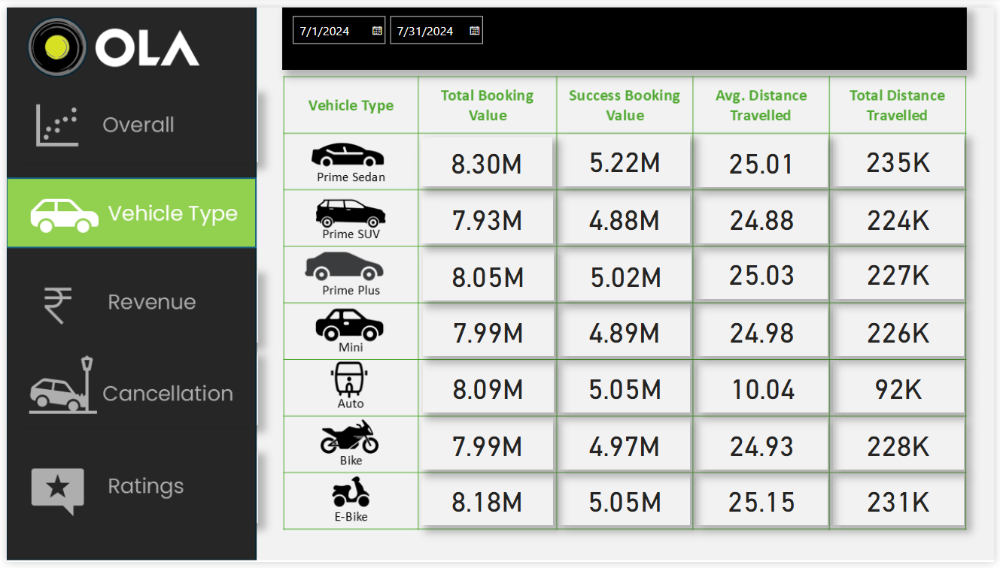
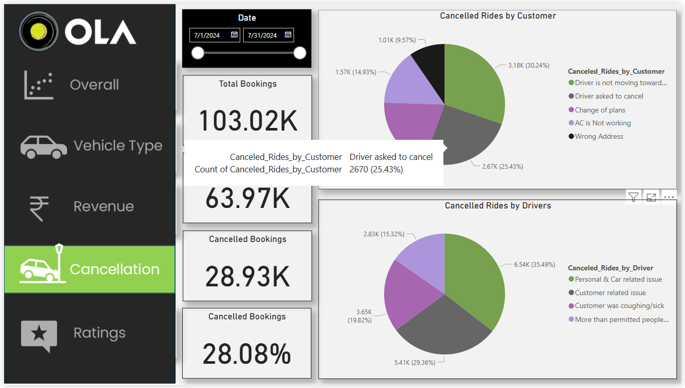
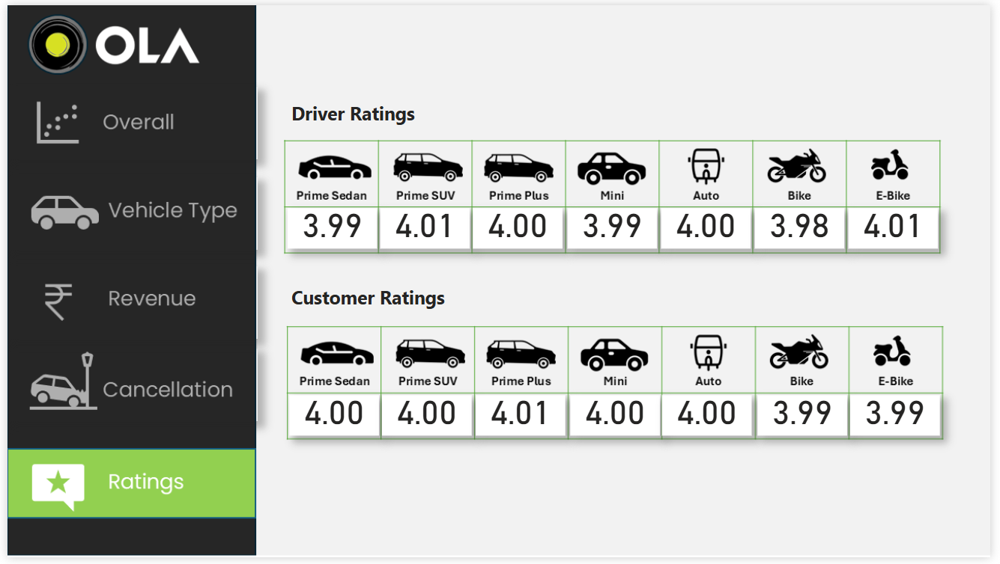

# Ola Ride Analysis Project

## 🚀 Project Overview

This project is a comprehensive analysis of Ola ride data to gain actionable insights that can enhance operational efficiency, service quality, and revenue generation. The analysis covers booking trends, cancellations, revenue patterns, and customer satisfaction.

## 🧑‍💻 Problem Statement

Ola is a leading ride-hailing service that provides a variety of vehicle options and payment methods. Despite its success, the platform faces challenges such as:

- High ride cancellation rates by both customers and drivers.
- Identifying the most and least preferred vehicle types.
- Understanding revenue trends based on ride distance, fare, and payment methods.
- Assessing customer and driver ratings to gauge service quality.

## 🎯 Objectives

- Analyze and identify the major causes of ride cancellations.
- Evaluate vehicle type popularity and performance.
- Assess revenue patterns across different metrics.
- Examine customer and driver ratings for service quality improvement.
- Provide actionable recommendations to mitigate cancellations and enhance customer satisfaction.

## 📊 Data Overview

The dataset contains 103,024 ride records and includes the following information:

- **Booking Status:** Whether the ride was completed or canceled.
- **Vehicle Type:** Includes categories like Mini, Prime Sedan, Prime SUV, eBike, etc.
- **Booking Value:** Fare charged per ride.
- **Payment Method:** Cash, UPI, Credit Card, Debit Card.
- **Ride Distance:** Total distance covered in each trip.
- **Driver & Customer Ratings:** Feedback scores.
- **Cancellation Reasons:** Reasons provided by customers or drivers.

## 📈 Key Performance Indicators (KPIs)

- **Cancellation Rate:** Analyze cancellation rates and identify underlying causes.
- **Revenue Analysis:** Assess total revenue and average fare per ride.
- **Ride Distance Insights:** Correlate ride distance with booking value.
- **Payment Trends:** Analyze customer preferences for payment methods.
- **Customer Satisfaction:** Evaluate rating trends for service improvements.

## 📌 Analysis Process

### **Step 1: Data Cleaning and Management (Excel)**

- Performed initial data cleaning and formatting using **Excel**.
- Handled missing values, removed duplicates, and ensured data consistency.

### **Step 2: Data Extraction and Transformation (SQL)**

- Executed SQL queries to perform data extraction and generate actionable insights.
- Applied transformations to analyze booking status, revenue trends, and customer behavior.

### **Step 3: Visualization and Dashboard Creation (Power BI)**

- Developed interactive dashboards using **Power BI** for visual representation.
- Incorporated DAX functions to calculate essential metrics.

## 📊 Dashboards Overview

### **1. Overall Dashboard**


- Displays key performance metrics like total bookings, completed vs. canceled rides, and total revenue.
- Provides a snapshot of Ola's operational efficiency.

### **2. Vehicle Type Dashboard**


- Compares ride volume, revenue contribution, and customer preference by vehicle type.
- Helps identify high-performing vehicle categories.

### **3. Revenue Dashboard**


- Evaluates revenue patterns based on ride distance and payment methods.
- Identifies the most profitable segments.

### **4. Cancellation Dashboard**


- Analyzes ride cancellations, highlighting customer and driver cancellation reasons.
- Provides insights to reduce cancellations and improve service reliability.

### **5. Ratings Dashboard**


- Evaluates driver and customer ratings to assess service quality.
- Identifies common complaints and suggests improvements.

## 📊 DAX Functions Used

In the **Power BI** dashboards, the following **DAX functions** were used for calculated measures and visual insights:

- `CanceledBookings = CALCULATE(COUNTROWS(Ola_bookings), Ola_bookings[Booking_Status] IN {"Canceled by Driver", "Canceled by Customer"})`
- `CanceledPercentage = DIVIDE([CanceledBookings], [TotalBookings], 0)`
- `TotalBookings = COUNTROWS(Ola_bookings)`

## 🛠️ Tools Used

1. **Excel**: For data cleaning and management.
2. **SQL**: For data extraction and transformation.
3. **Power BI**: For interactive visualizations and dashboards.

## 📥 Installation & Setup

1. Clone the repository:
   ```bash
   git clone https://github.com/username/ola-ride-analysis.git
   ```
2. Open the `.pbix` file using **Power BI** to view the dashboards.
3. Execute SQL queries from `ola_sql_query.sql` to extract data.


