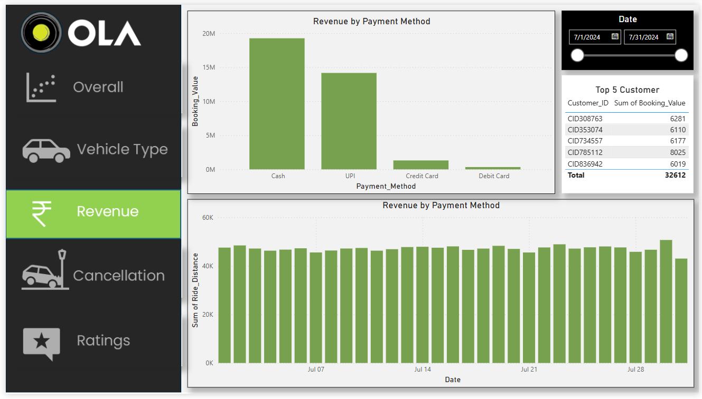

# Ola Ride Analysis Project

## 🚀 Project Overview

This project analyzes Ola ride data to find useful insights that can help improve operations, service quality, and revenue. The focus is on booking trends, cancellations, revenue patterns, and customer satisfaction.

## 🧑‍💻 Problem Statement

Ola, a ride-hailing service, faces challenges such as:

- High ride cancellations by both customers and drivers.
- Understanding which vehicle types are preferred.
- Tracking revenue based on distance, fare, and payment methods.
- Evaluating customer and driver ratings for service quality.

## 🎯 Objectives

- Find reasons for ride cancellations.
- Identify the most and least popular vehicle types.
- Analyze revenue trends.
- Evaluate customer and driver ratings.
- Provide suggestions for reducing cancellations and improving service.

## 📊 Data Overview

The dataset includes 103,024 ride records with details like:

- **Booking Status**: Completed or Canceled.
- **Vehicle Type**: Mini, Prime Sedan, Prime SUV, eBike, etc.
- **Booking Value**: Fare charged per ride.
- **Payment Method**: Cash, UPI, Credit Card, Debit Card.
- **Ride Distance**: Total trip distance.
- **Driver & Customer Ratings**: Feedback scores.
- **Cancellation Reasons**: Provided by customers or drivers.

## 📈 Key Performance Indicators (KPIs)

- **Cancellation Rate**: Track ride cancellations and reasons.
- **Revenue Analysis**: Measure total revenue and average fare per ride.
- **Ride Distance Insights**: Study the effect of ride distance on revenue.
- **Payment Trends**: Identify customer payment preferences.
- **Customer Satisfaction**: Analyze rating trends for service improvement.

## 📂 Dataset Structure

- **Raw Data**: Ola_bookings.csv (Original data)
- **Processed Data**: Cleaned and analyzed in Power BI.
- **Domain Knowledge**: Domain_Knowledge.docx
- **Problem Statement**: Problem_Statement.docx
- **SQL Queries**: ola_sql_query.sql
- **Power BI Report**: ola_analysis.pbix

## 📌 Analysis Process

1. **Data Cleaning (Excel)**
    - Fixed missing values and removed duplicates.
    - Formatted data for further analysis.

2. **Data Analysis (SQL)**
    - Ran SQL queries to extract useful insights.
    - Filtered data to analyze cancellations, revenue, and customer behavior.

3. **Visualization (Power BI)**
    - Created dashboards using Power BI.
    - Used DAX functions for calculating key metrics.

## 📊 Dashboards Overview

### **1. Overall Dashboard**


- Shows total bookings, completed vs. canceled rides, and total revenue.
- Provides a quick view of operational performance.

### **2. Vehicle Type Dashboard**


- Displays ride volume and revenue by vehicle type.
- Identifies which vehicle types are most profitable.

### **3. Revenue Dashboard**


- Analyzes revenue by ride distance and payment methods.
- Helps find the most profitable segments.

### **4. Cancellation Dashboard**


- Studies cancellation reasons.
- Provides actionable insights to reduce cancellations.

### **5. Ratings Dashboard**


- Examines driver and customer ratings.
- Identifies areas for service improvement.

## 📊 DAX Functions Used

These DAX functions were used in Power BI to calculate metrics:

```dax
CanceledBookings = CALCULATE(COUNTROWS(Ola_bookings), Ola_bookings[Booking_Status] IN {"Canceled by Driver", "Canceled by Customer"})
CanceledPercentage = DIVIDE([CanceledBookings], [TotalBookings], 0)
TotalBookings = COUNTROWS(Ola_bookings)
```

## 🛠️ Tools Used

1. **Excel**: Data cleaning and management.
2. **SQL**: Data extraction and analysis.
3. **Power BI**: Dashboard visualization.

## 📥 How to Run the Project

1. Clone the repository:
    ```bash
    git clone https://github.com/username/ola-ride-analysis.git
    ```
2. Open the `.pbix` file using Power BI.
3. Execute SQL queries from `ola_sql_query.sql` using SQL Server Management Studio (SSMS).
